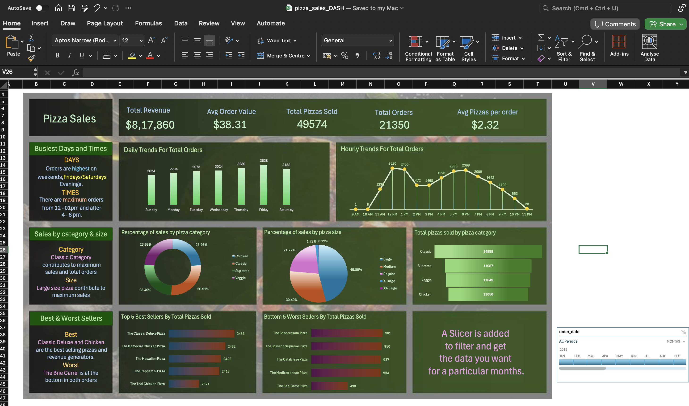

# Excel-Project
# 🍕 Pizza Sales Excel Dashboard

This project features an interactive and visually appealing **Excel dashboard** that analyzes pizza sales performance across multiple dimensions — including revenue, order trends, category-wise sales, and time-based behavior. Built using Microsoft Excel on macOS, it showcases the power of Excel dashboards for quick and effective business intelligence.

---

## 📊 Dashboard Overview

---

## ✅ Features

- **KPI Cards**: Highlights total revenue, average order value, total pizzas sold, total orders, and average pizzas per order.
- **Interactive Timeline Filter**: Enables filtering the dashboard by month using a built-in Excel Timeline slicer.
- **Bar Charts & Line Graphs**:
  - Daily and hourly order trends.
  - Sales by category and size.
  - Best and worst selling pizzas.
- **Pie Charts**:
  - Distribution of pizza sales by category.
  - Sales by pizza size.
- **Insights Section**:
  - Clear summary of key patterns in days/times, best sellers, and category contributions.

---

## 📅 Time-Based Filtering

- A **Timeline slicer** has been added (bottom-right) to allow filtering data by **month and year**.
- Timeline can be customized or formatted via the **Format** tab in Excel's ribbon.

---

## 📁 Files

- `pizza_sales_DASH.xlsx`: Main Excel dashboard file.
- `README.md`: This documentation.
- `image.png`: Screenshot of the dashboard

---

## 🛠 Tools Used

- **Microsoft Excel for Mac**
- Pivot Tables
- Pivot Charts
- Slicers & Timeline Filters
- Conditional Formatting
- Custom cell styling and chart formatting

---

## 🚀 Getting Started

1. Clone or download the repository.
2. Open `pizza_sales_DASH.xlsx` in Excel.
3. Use the Timeline slicer to filter the dashboard by month/year.
4. Explore insights and visuals on pizza sales trends.

---

## 📌 Notes

- This dashboard is optimized for Mac Excel layout.
- If you're using Excel on Windows, ensure timeline and slicer functionality is enabled.
- You can customize chart colors, styles, and layout via the Ribbon's **Format** and **Chart Design** tabs.

---

## 📷 Preview

---

## 📬 Feedback & Contributions

Feel free to submit pull requests or raise issues if you'd like to contribute or improve the dashboard.

---
